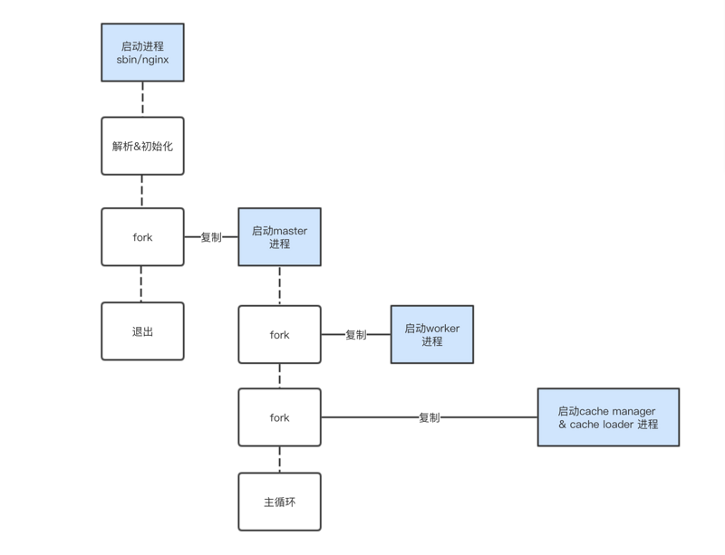
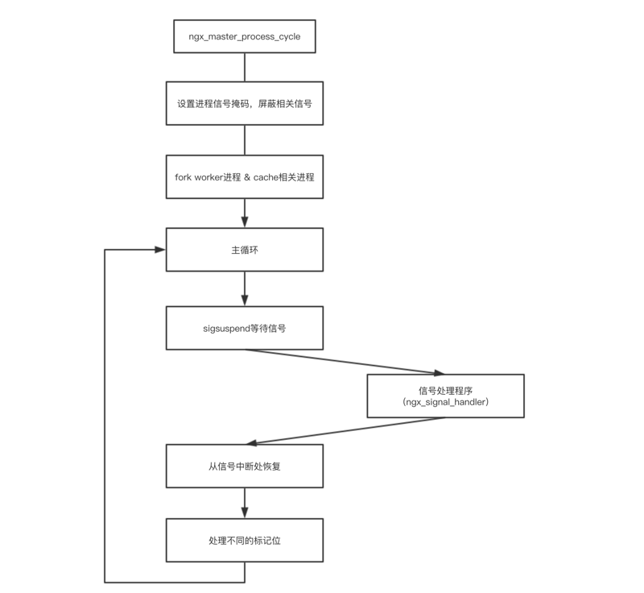

【Nginx源码研究】Master进程浅析 - Nginx源码分析 - SegmentFault 思否

 
 
 运营研发团队 季伟滨

众所周如，Nginx是多进程架构。有1个master进程和N个worker进程，一般N等于cpu的核数。另外， 和文件缓存相关，还有cache manager和cache loader进程。

master进程并不处理网络请求，网络请求是由worker进程来处理，而master进程负责管理这些worker进程。比如当一个worker进程意外挂掉了，他负责拉起新的worker进程，又比如通知所有的worker进程平滑的退出等等。本篇wiki将简单分析下master进程是如何做管理工作的。

在开始讲解master进程之前，我们需要首先知道，其实Nginx除了生产模式（多进程+daemon）之外，还有其他的进程模式，虽然这些模式一般都是为了研发&调试使用。

## 非daemon模式

以非daemon模式启动的nginx进程并不会立刻退出。其实在终端执行非bash内置命令，终端进程会fork一个子进程，然后exec执行我们的nginx bin。然后终端进程本身会进入睡眠态，等待着子进程的结束。在nginx的配置文件中，配置【daemon off;】即可让进程模式切换到前台模式。

下图展示了一个测试例子，将worker的个数设置为1，开启非daemon模式，开启2个终端pts/0和pts/1。在pts/1上执行nginx，然后在pts/0上看进程的状态，可以看到终端进程进入了阻塞态（睡眠态）。这种情况下启动的master进程，它的父进程是当前的终端进程(/bin/bash)，随着终端的退出（比如ctrl+c），所有nginx进程都会退出。

## single模式

nginx可以以单进程的形式对外提供完整的服务。这里进程可以是daemon，也可以不是daemon进程，都没有关系。在nginx的配置文件中，配置【master_process off;】即可让进程模式切换到单进程模式。这时你会看到，只有一个进程在对外服务。

## 生产模式（多进程+daemon)

想像一下一般我们是怎么启动nginx的，我在自己的vm上把Nginx安装到了/home/xiaoju/nginx-jiweibin，所以启动命令一般是这样：

    /home/xiaoju/nginx-jiweibin/sbin/nginx

然后，ps -ef|grep nginx就会发现启动好了master和worker进程，像下面这样（warn是由于我修改worker\_processes为1，但未修改worker\_cpu_affinity，可以忽略）

这里和非daemon模式的一个很大区别是启动程序（终端进程的子进程）会立刻退出，并被终端进程这个父进程回收。同时会产生master这种daemon进程，可以看到master进程的父进程id是1，也就是init或systemd进程。这样，随着终端的退出，master进程仍然可以继续服务，因为master进程已经和启动nginx命令的终端shell进程无关了。

启动nginx命令，是如何生成daemon进程并退出的呢？答案很简单，同样是fork系统调用。它会复制一个和当前启动进程具有相同代码段、数据段、堆和栈、fd等信息的子进程（尽管cow技术使得复制发生在需要分离那一刻），参见图-1。

  
图1-生产模式Nginx进程启动示意图

master进程被fork后，继续执行ngx\_master\_process_cycle函数。这个函数主要进行如下操作：

*   1、设置进程的初始信号掩码，屏蔽相关信号
*   2、fork子进程，包括worker进程和cache manager进程、cache loader进程
*   3、进入主循环，通过sigsuspend系统调用，等待着信号的到来。一旦信号到来，会进入信号处理程序。信号处理程序执行之后，程序执行流程会判断各种状态位，来执行不同的操作。

  
图2- ngx\_master\_process_cycle执行流程示意图

master进程的主循环里面，一直通过等待各种信号事件，来处理不同的指令。这里先普及信号的一些知识，有了这些知识的铺垫再看master相关代码会更加从容一些（如果对信号比较熟悉，可以略过这一节）。

## 标准信号和实时信号

信号分为标准信号（不可靠信号）和实时信号（可靠信号），标准信号是从1-31，实时信号是从32-64。一般我们熟知的信号比如，SIGINT,SIGQUIT,SIGKILL等等都是标准信号。master进程监听的信号也是标准信号。标准信号和实时信号有一个区别就是：标准信号，是基于位的标记，假设在阻塞等待的时候，多个相同的信号到来，最终解除阻塞时，只会传递一次信号，无法统计等待期间信号的计数。而实时信号是通过队列来实现，所以，假设在阻塞等待的时候，多个相同的信号到来，最终解除阻塞的时候，会传递多次信号。

## 信号处理器

信号处理器是指当捕获指定信号时（传递给进程）时将会调用的一个函数。信号处理器程序可能随时打断进程的主程序流程。内核代表进程来执行信号处理器函数，当处理器返回时，主程序会在处理器被中断的位置恢复执行。（主程序在执行某一个系统调用的时候，有可能被信号打断，当信号处理器返回时，可以通过参数控制是否重启这个系统调用）。

信号处理器函数的原型是：void (* sighandler_t)(int)；入参是1-31的标准信号的编号。比如SIGHUP的编号是1，SIGINT的编号是2。

通过sigaction调用可以对某一个信号安装信号处理器。函数原型是：int sigaction(int sig,const struct sigaction _act,struct sigaction_ oldact); sig表示想要监听的信号。act是监听的动作对象，这里包含信号处理器的函数指针，oldact是指之前的信号处理器信息。见下面的结构体定义：

    struct sigaction{
           void (*sa_handler)(int); 
           sigset_t sa_mask; 
           int sa_flags;
           void (*sa_restorer)(void); 
    }

*   sa\_hander就是我们的信号处理器函数指针。除了捕获信号外，进程对信号的处理还可以有忽略该信号（使用SIG\_IGN常量)和执行缺省操作（使用SIG_DFL常量）。这里需要注意，SIGKILL信号和SIGSTOP信号不能被捕获、阻塞、忽略的。
*   sa\_mask是一组信号，在sa\_handler执行期间，会将这组信号加入到进程信号掩码中（进程信号掩码见下面描述），对于在sa_mask中的信号，会保持阻塞。
*   sa\_flags包含一些可以改变处理器行为的标记位，比如SA\_NODEFER表示执行信号处理器时不自动将该信号加入到信号掩码 SA_RESTART表示自动重启被信号处理器中断的系统调用。
*   sa_restorer仅内部使用，应用程序很少使用。

## 发送信号

一般我们给某个进程发送信号，可以使用kill这个shell命令。比如kill -9 pid，就是发送SIGKILL信号。kill -INT pid，就可以发送SIGINT信号给进程。与shell命令类似，可以使用kill系统调用来向进程发送信号。

函数原型是：（注意，这里发送的一般都是标准信号，实时信号使用sigqueue系统调用来发送）。

    int kill(pit_t pid, int sig); 

另外，子进程退出，会自动给父进程发送SIGCHLD信号，父进程可以监听这一信号来满足相应的子进程管理，如自动拉起新的子进程。

## 进程信号掩码

内核会为每个进程维护一个信号掩码。信号掩码包含一组信号，对于掩码中的信号，内核会阻塞其对进程的传递。信号被阻塞后，对信号的传递会延后，直到信号从掩码中移除。

假设通过sigaction函数安装信号处理器时不指定SA_NODEFER这个flag，那么执行信号处理器时，会自动将捕获到的信号加入到信号掩码，也就是在处理某一个信号时，不会被相同的信号中断。

通过sigprocmask系统调用，可以显式的向信号掩码中添加或移除信号。函数原型是：

    int sigprocmask(int how, const sigset_t *set, sigset_t *oldset);

how可以使下面3种：

*   SIG_BLOCK：将set指向的信号集内的信号添加到信号掩码中。即信号掩码是当前值和set的并集。
*   SIG_UNBLOCK：将set指向的信号集内的信号从信号掩码中移除。
*   SIG_SETMASK：将信号掩码赋值为set指向的信号集。

## 等待信号

在应用开发中，可能需要存在这种业务场景：进程需要首先屏蔽所有的信号，等相应工作已经做完之后，解除阻塞，然后一直等待着信号的到来（在阻塞期间有可能并没有信号的到来）。信号一旦到来，再次恢复对信号的阻塞。

linux编程中，可以使用int pause(void)系统调用来等待信号的到来，该调用会挂起进程，直到信号到来中断该调用。基于这个调用，对于上面的场景可以编写下面的伪代码：

    struct sigaction sa;
    sigset_t initMask,prevMask;
     
    sigemptyset(&sa.sa_mask);
    sa.sa_flags = 0;
    sa.sa_handler = handler;
     
    sigaction(SIGXXX,&sa,NULL); 
     
     
    sigemptyset(&initMask);
    sigaddset(&initMask,xxx);
    sigaddset(&initMask,yyy);
    ....
     
    sigprocmask(SIG_BLOCK,&initMask,&prevMask); 
     
    do_something() 
     
    sigprocmask(SIG_SETMASK,&prevMask,NULL); 
     
    pause(); 
     
    sigprocmask(SIG_BLOCK,&initMask,&prevMask); 
     
    do_something2(); 

想想上面的代码会有什么问题？假设某一个信号，在上面的4之后，5之前到来，也就是解除阻塞之后，等待信号调用之前到来，信号会被信号处理器所处理，并且pause调用会一直陷入阻塞，除非有第二个信号的到来。这和我们的预期是不符的。这个问题本质是，解除阻塞和等待信号这2步操作不是原子的，出现了竞态条件。这个竞态条件发生在主程序和信号处理器对同一个被解除信号的竞争关系。

要避免这个问题，可以通过sigsuspend调用来等待信号。函数原型是：

    int sigsuspend(const sigset_t *mask);

它接收一个掩码参数mask，用mask替换进程的信号掩码，然后挂起进程的执行，直到捕获到信号，恢复进程信号掩码为调用前的值，然后调用信号处理器，一旦信号处理器返回，sigsuspend将返回-1，并将errno置为EINTR

master进程启动之后，就会处于挂起状态。它等待着信号的到来，并处理相应的事件，如此往复。本节让我们看下nginx是如何基于信号构建事件监听框架的。

## 安装信号处理器

在nginx.c中的main函数里面，初始化进程fork master进程之前，就已经通过调用ngx\_init\_signals函数安装好了信号处理器，接下来fork的master以及work进程都会继承这个信号处理器。让我们看下源代码：

    
     
    int ngx_cdecl
    main(int argc, char *const *argv)
    {
        ....
        cycle = ngx_init_cycle(&init_cycle);
        ...
        if (ngx_init_signals(cycle->log) != NGX_OK) { 
            return 1;
        }
     
        if (!ngx_inherited && ccf->daemon) { 
            if (ngx_daemon(cycle->log) != NGX_OK) { 
            return 1;
            }
            ngx_daemonized = 1;
        }
        ...
    }
     
    
     
    typedef struct {
        int     signo;
        char   *signame;
        char   *name;
        void  (*handler)(int signo);
    } ngx_signal_t;
     
    ngx_signal_t  signals[] = {
        { ngx_signal_value(NGX_RECONFIGURE_SIGNAL),
          "SIG" ngx_value(NGX_RECONFIGURE_SIGNAL),
          "reload",
          ngx_signal_handler },
         ...
     
        { SIGCHLD, "SIGCHLD", "", ngx_signal_handler },
     
        { SIGSYS, "SIGSYS, SIG_IGN", "", SIG_IGN },
     
        { SIGPIPE, "SIGPIPE, SIG_IGN", "", SIG_IGN },
     
        { 0, NULL, "", NULL }
    };
     
    ngx_int_t
    ngx_init_signals(ngx_log_t *log)
    {
        ngx_signal_t      *sig;
        struct sigaction   sa;
     
        for (sig = signals; sig->signo != 0; sig++) {
            ngx_memzero(&sa, sizeof(struct sigaction));
            sa.sa_handler = sig->handler;
            sigemptyset(&sa.sa_mask);
            if (sigaction(sig->signo, &sa, NULL) == -1) {
    #if (NGX_VALGRIND)
                ngx_log_error(NGX_LOG_ALERT, log, ngx_errno,
                              "sigaction(%s) failed, ignored", sig->signame);
    #else
                ngx_log_error(NGX_LOG_EMERG, log, ngx_errno,
                              "sigaction(%s) failed", sig->signame);
                return NGX_ERROR;
    #endif
            }
        }
     
        return NGX_OK;
    }

全局变量signals是ngx\_signal\_t的数组，包含了nginx进程（master进程和worker进程）监听的所有的信号。

ngx\_signal\_t有4个字段，signo表示信号的编号，signame表示信号的描述字符串，name在nginx -s时使用，用来作为向nginx master进程发送信号的快捷方式，例如nginx -s reload相当于向master进程发送一个SIGHUP信号。handler字段表示信号处理器函数指针。

下面是针对不同的信号安装的信号处理器列表：

通过上表，可以看到，在nginx中，只要捕获的信号，信号处理器都是ngx\_signal\_handler。ngx\_signal\_handler的实现细节将在后面进行介绍。

## 设置进程信号掩码

在ngx\_master\_process_cycle函数里面，fork子进程之前，master进程通过sigprocmask系统调用，设置了进程的初始信号掩码，用来阻塞相关信号。

而对于fork之后的worker进程，子进程会继承信号掩码，不过在worker进程初始化的时候，对信号掩码又进行了重置，所以worker进程可以并不阻塞信号的传递。

    void
    ngx_master_process_cycle(ngx_cycle_t *cycle)
    {
        ...
        sigset_t           set;
        ...
     
        sigemptyset(&set);
        sigaddset(&set, SIGCHLD);
        sigaddset(&set, SIGALRM);
        sigaddset(&set, SIGIO);
        sigaddset(&set, SIGINT);
        sigaddset(&set, ngx_signal_value(NGX_RECONFIGURE_SIGNAL));
        sigaddset(&set, ngx_signal_value(NGX_REOPEN_SIGNAL));
        sigaddset(&set, ngx_signal_value(NGX_NOACCEPT_SIGNAL));
        sigaddset(&set, ngx_signal_value(NGX_TERMINATE_SIGNAL));
        sigaddset(&set, ngx_signal_value(NGX_SHUTDOWN_SIGNAL));
        sigaddset(&set, ngx_signal_value(NGX_CHANGEBIN_SIGNAL));
     
        if (sigprocmask(SIG_BLOCK, &set, NULL) == -1) {
            ngx_log_error(NGX_LOG_ALERT, cycle->log, ngx_errno,
                          "sigprocmask() failed");
        }
        ...

## 挂起进程

当做完上面2项准备工作后，就会进入主循环。在主循环里面，master进程通过sigsuspend系统调用，等待着信号的到来，在等待的过程中，进程一直处于挂起状态（S状态）。至此，master进程基于信号的整体事件监听框架讲解完成，关于信号到来之后的逻辑，我们在下一节讨论。

    void
    ngx_master_process_cycle(ngx_cycle_t *cycle)
    {
      ....
      if (sigprocmask(SIG_BLOCK, &set, NULL) == -1) {
        ngx_log_error(NGX_LOG_ALERT, cycle->log, ngx_errno,
                      "sigprocmask() failed");
      }
       
      sigemptyset(&set); 
      ...
      ngx_start_worker_processes(cycle, ccf->worker_processes,
                               NGX_PROCESS_RESPAWN); 
      ngx_start_cache_manager_processes(cycle, 0); 
      ...
       
      for ( ;; ) {
         ...
         sigsuspend(&set); 
         
         ... 
     
      }
     
    } 

## 进程数据结构

在展开说明之前，我们需要了解下，nginx对进程的抽象的数据结构。

    ngx_int_t        ngx_last_process; 
    ngx_process_t    ngx_processes[NGX_MAX_PROCESSES]; 
     
    typedef struct {
        ngx_pid_t           pid; 
        int                 status; 
        ngx_socket_t        channel[2]; 
     
        ngx_spawn_proc_pt   proc; 
        void               *data; 
        char               *name; 
     
        unsigned            respawn:1; 
        unsigned            just_spawn:1; 
        unsigned            detached:1; 
        unsigned            exiting:1; 
        unsigned            exited:1; 
    } ngx_process_t;

比如我只启动了一个worker进程，gdb master进程，ngx\_processes和ngx\_last_process的结果如图3所示：

图3-gdb单worker进程下ngx\_processes和ngx\_last_process的结果

## 全局标记

上面我们提到ngx\_signal\_handler这个函数，它是nginx为捕获的信号安装的通用信号处理器。它都干了什么呢？很简单，它只是用来标记对应的全局标记位为1，这些标记位，后续的主循环里会使用到，根据不同的标记位，执行不同的逻辑。

master进程对应的信号与全局标记位的对应关系如下表：

对于SIGCHLD信号，情况有些复杂，ngx\_signal\_handler还会额外多做一件事，那就是调用ngx\_process\_get\_status函数去做子进程的回收。在ngx\_process\_get\_status内部，会使用waitpid系统调用获取子进程的退出状态，并回收子进程，避免产生僵尸进程。同时，会更新ngx_processes数组中相应的退出进程的exited为1，表示进程已退出，并被父进程回收。

现在考虑一个问题：假设在进程屏蔽信号并且进行各种标记位的逻辑处理期间（下面会讲标记位的逻辑流程），同时有多个子进程退出，会产生多个SIGCHLD信号。但由于SIGCHLD信号是标准信号（非可靠信号），当sigsuspend等待信号时，只会被传递一个SIGCHLD信号。那么这样是否有问题呢？答案是否定的，因为ngx\_process\_get\_status这里是循环的调用waitpid，所以在一个信号处理器的逻辑流程里面，会回收尽可能多的退出的子进程，并且更新ngx\_processes中相应进程的exited标记位，因此不会存在漏掉的问题。

    static void
    ngx_process_get_status(void)
    {
        ...
        for ( ;; ) {
            pid = waitpid(-1, &status, WNOHANG);
     
            if (pid == 0) {
                return;
            }
     
            if (pid == -1) {
                err = ngx_errno;
     
                if (err == NGX_EINTR) {
                    continue;
                }
     
                if (err == NGX_ECHILD && one) {
                    return;
                }
     
                ...
                return;
            }
     
            ...
     
            for (i = 0; i < ngx_last_process; i++) {
                if (ngx_processes[i].pid == pid) {
                    ngx_processes[i].status = status;
                    ngx_processes[i].exited = 1;
                    process = ngx_processes[i].name;
                    break;
                }
            }
            ...
        }
    }

逻辑流程  
主循环，针对不同的全局标记，执行不同action的整体逻辑流程见图4：

  
图4-主循环逻辑流程

上面的流程图，总体还是比较复杂的，根据具体的场景去分析会更加清晰一些。在此之前，下面先就图上一些需要描述的给予解释说明：

*   1、临时变量live，它表示是否仍有存活的子进程。只有当ngx\_processes中所有的子进程的exited标记位都为1时，live才等于0。而master进程退出的条件是【!live && (ngx\_terminate || ngx_quit)】，即所有的子进程都已退出，并且接收到SIGTERM、SIGINT或者SIGQUIT信号时，master进程才会正常退出（通过SIGKILL信号杀死master一般在异常情况下使用，这里不算）。
*   2、在循环的一开始，会判断delay是否大于0，这个delay其实只和ngx_terminate即强制退出的场景有关系。在后面会详细讲解。
*   3、ngx\_terminate、ngx\_quit、ngx_reopen这3种标记，master进程都会通过上面提到的socket channel向子进程进行广播。如果写socket失败，会执行kill系统调用向子进程发送信号。而其他的case，master会直接执行kill系统调用向子进程发送信号，比如发送SIGKILL。关于socket channel，后续会进行讲解。
*   4、除了和信号直接映射的标记位，我们看到，流程图中还有ngx\_noaccepting和ngx\_restart这2个全局标记位以及ngx\_new\_binary这个全局变量。ngx\_noaccepting表示当前master下的所有的worker进程正在退出或已退出，不再对外服务。ngx\_restart表示需要重新启动worker子进程，ngx\_new\_binary表示升级binary时新的master进程的pid，这3个都和升级binary有关系。

## socket channel

nginx中进程之间通信的方式有多种，socket channel是其中之一。这种方式，不如共享内存使用的广泛，目前主要被使用在master进程广播消息到子进程，这里面的消息包括下面5种：

    #define NGX_CMD_OPEN_CHANNEL 1 
    #define NGX_CMD_CLOSE_CHANNEL 2 
    #define NGX_CMD_QUIT 3  
    #define NGX_CMD_TERMINATE 4 
    #define NGX_CMD_REOPEN 5 

master进程在创建子进程的时候，fork调用之前，会在ngx\_processes中选择空闲的ngx\_process\_t，这个空闲的ngx\_process\_t的下标为s（s不超过1023）。然后通过socketpair调用创建一对匿名socket，相对应的fd存储在ngx\_process\_t的channel中。并且把s赋值给全局变量ngx\_process\_slot，把channel\[1\]赋值给全局变量ngx\_channel。

    ngx_pid_t
    ngx_spawn_process(ngx_cycle_t *cycle, ngx_spawn_proc_pt proc, void *data,char *name, ngx_int_t respawn) {
       
    ...
     
    if (socketpair(AF_UNIX, SOCK_STREAM, 0, ngx_processes[s].channel) == -1) 
    {
        ngx_log_error(NGX_LOG_ALERT, cycle->log, ngx_errno,
                      "socketpair() failed while spawning \"%s\"", name);
        return NGX_INVALID_PID;
    }
    ...
    ngx_channel = ngx_processes[s].channel[1];
    ...
    ngx_process_slot = s;
    pid = fork(); 
    ...

fork之后，子进程继承了这对socket。因为他们共享了相同的系统级打开文件，这时master进程写channel\[0\]，子进程就可以通过channel\[1\]读取到数据，master进程写channel\[1\]，子进程就可以通过channel\[0\]读取到数据。子进程向master通信也是如此。这样在fork N个子进程之后，实际上会建立N个socket channel，如图5所示。

  
图5-master和子进程通过socket channel通信原理

在nginx中，对于socket channel的使用，总是使用channel\[0\]作为数据的发送端，channel\[1\]作为数据的接收端。并且master进程和子进程的通信是单向的，因此在后续子进程初始化时关闭了channel\[0\]，只保留channel\[1\]即ngx\_channel。同时将ngx\_channel的读事件添加到整个nginx高效的事件框架中（关于事件框架这里限于篇幅不多谈），最终实现了master进程向子进程消息的同步。

了解到这里，其实socket channel已经差不多了。但是还不是它的全部，nginx源码中还提供了通过socket channel进行子进程之间互相通信的机制。不过目前来看，没有实际的使用。

让我们先思考一个问题：如果要实现worker之间的通信，难点在于什么？答案不难想到，master进程fork子进程是有顺序的，fork最后一个worker和master进程一样，知道所有的worker进程的channel\[0\]，因此它可以像master一样和其他的worker通信。但是第一个worker就很糟糕了，它只知道自己的channel\[0\](而且还是被关闭了），也就是第一个worker无法主动向任意其他的woker进程通信。在图6中可以看到，对于第二个worker进程，仅仅知道第一个worker的channel\[0\]，因此仅仅可以和第一个worker进行通信。

  
图6-第二个worker进程的channel示意图

nginx是怎么解决这个问题的呢？简单来讲， nginx使用了进程间传递文件描述符的技术。关于进程间传递文件描述符，这里关键的系统调用涉及到2个，socketpair和sendmsg，这里不细讲，有兴趣的可以参考下这篇文章：[https://pureage.info/2015/03/...](https://pureage.info/2015/03/19/passing-file-descriptors.html)。

master在每次fork新的worker的时候，都会通过ngx\_pass\_open\_channel函数将新创建进程的pid以及的socket channel写端channel\[0\]传递给所有之前创建的worker。上面提到的NGX\_CMD\_OPEN\_CHANNEL就是用来做这件事的。worker进程收到这个消息后，会解析消息的pid和fd，存储到ngx\_processes中相应slot下的ngx\_process_t中。

这里channel\[1\]并没有被传递给子进程，因为channel\[1\]是接收端，每一个socket channel的channe\[1\]都唯一对应一个子进程，worker A持有worker B的channel\[1\]，并没有任何意义。因此在子进程初始化时，会将之前worker进程创建的channel\[1\]全部关闭掉，只保留的自己的channel\[1\]。最终，如图7所示，每一个worker持有自己的channel的channel\[1\]，持有着其他worker对应channel的channel\[0\]。而master则持有者所有的worker对应channel的channel\[0\]和channel\[1\]（为什么这里master仍然保留着所有channel的channe\[1\]，没有想明白为什么，也许是为了在未来监听worker进程的消息）。

  
图7-socket channel最终示意图

## 进程退出

这里进程退出包含多种场景：

*   1、worker进程异常退出
*   2、系统管理员使用nginx -s stop或者nginx -s quit让进程全部退出
*   3、系统管理员使用信号SIGINT,SIGTERM,SIGQUIT等让进程全部退出
*   4、升级binary期间，新master进程退出（当发现重启的nginx有问题之后，可能会杀死新master进程）

对于场景1，master进程需要重新拉起新的worker进程。对于场景2和3，master进程需要等到所有的子进程退出后再退出（避免出现孤儿进程）。对于场景4，本小节先不介绍，在后面会介绍binary升级。下面我们了解下master进程是如何实现前三个场景的。

## 处理子进程退出

子进程退出时，发送SIGCHLD信号给父进程，被信号处理器处理，会更新ngx\_reap全局标记位，并且使用waitpid收集所有的子进程，设置ngx\_processes中对应slot下的ngx\_process\_t中的exited为1。然后，在主循环中使用ngx\_reap\_children函数，对子进程退出进行处理。这个函数非常重要，是理解进程退出的关键。

  
图8-ngx\_reap\_children函数流程图

通过上图，可以看到ngx\_reap\_children函数的整体执行流程。它遍历ngx_processes数组里有效（pid不等于-1）的worker进程：

*   一、如果子进程的exited标志位为1（即已退出并被master回收）
    
    *   1、如果子进程是游离进程（detached为1）
        
        *   1.1、如果退出的子进程是新master进程（升级binary时会fork一个新的master进程），会将旧的pid文件恢复，即恢复使用当前的master来服务【场景4】
            
            *   （1）如果当前master进程已经将它下面的worker都杀掉了（ngx\_noaccepting为1），这时会修改全局标记位ngx\_restart为1，然后跳到步骤1.c。在外层的主循环里，检测到这个标记位，master进程便会重新fork worker进程
            *   （2）如果当前的master进程还没有杀死他的子进程，直接跳到步骤1.c
        *   1.2、如果退出的子进程是其他进程，直接跳到步骤1.c（实际上这种case不存在，因为目前看，所有的detached的进程都是新master进程。detached只有在升级binary时才使用到）
    *   2、如果子进程不是游离进程（detached为0），通过socket channel通知其他的worker进程NGX\_CMD\_CLOSE_CHANNEL指令，管道需要关闭（我要死了，以后不用给我打电话了）
        
        *   2.1、如果子进程是需要复活的（进程标记respawn为1，并没有收到过相关退出信号），那么fork新的worker进程取代死掉的子进程，并通过socket channel通知其他的worker进程NGX\_CMD\_OPEN_CHANNEL指令，新的worker已启动，请记录好新启动进程的pid和channel\[0\]（大家好，我是新worker xxx，这是我的电话，有事随时call me），同时置live为1，表示还有存活的子进程，master进程不可退出。然后继续遍历下一个进程【场景1】
        *   2.2、如果不需要复活，直接跳到步骤1.c【场景2+场景3】
    *   3、对于退出的进程，置ngx\_process\_t中的pid为-1，继续遍历下一个进程
*   二、如果子进程exited标志为0，即没有退出
    
    *   1、如果子进程是非游离进程，那么更新live为1，然后继续遍历下一个进程。live为1表示还有存活的子进程，master进程不可退出（对这里的判断条件ngx\_processes\[i\].exiting || !ngx\_processes\[i\].detached存疑，大部分worker都是非游离，游离的进程只有升级 binary时的新master进程，但是新master退出时，并不会修改exiting为1，所以个人觉得这里的ngx_processes\[i\].exiting的判断没有必要，只需要判断是否游离进程即可）
    *   2、如果子进程是游离进程，那么忽略，遍历下一个进程。也就是说，master并不会因为游离子进程没有退出，而停止退出的步伐。（在这种case下，游离进程就像别人家的孩子一样，master不再关心）

最终，ngx\_reap\_children会妥善的处理好各种场景的子进程退出，并且返回live的值。即告诉主循环，当前是否仍有存活的子进程存在。在主循环里，当!live && (ngx\_terminate || ngx\_quit)条件满足时，master进程就会做相应的进程退出工作（删除pid文件，调用每一个模块的exit_master函数，关闭监听的socket，释放内存池）。

## 触发子进程退出

对于场景2和场景3，当master进程收到SIGTERM或者SIGQUIT信号时，会在信号处理器中设置ngx\_terminate或ngx\_quit全局标记。当主循环检测到这2种标记时，会通过socket channel向所有的子进程广播消息，传递的指令分别是：NGX\_CMD\_TERMINATE或NGX\_CMD\_QUIT。子进程通过事件框架检测到该消息后，同样会设置ngx\_terminate或者ngx\_quit标记位为1（注意这里是子进程的全局变量）。子进程的主循环里检测到ngx\_terminate时，会立即做进程退出工作(调用每一个模块的exit\_process函数，释放内存池），而检测到ngx_quit时，情况会稍微复杂些，需要释放连接，关闭监听socket，并且会等待所有请求以及定时事件都被妥善的处理完之后，才会做进程退出工作。

这里可能会有一个隐藏的问题：进程的退出可能没法被一次waitpid全部收集到，有可能有漏网之鱼还没有退出，需要等到下次的suspend才能收集到。如果按照上面的逻辑，可能存在重复给子进程发送退出指令的问题。nginx比较严谨，针对这个问题有自己的处理方式：

*   ngx\_quit：一旦给某一个worker进程发送了退出指令（强制退出或平滑退出），会记录该进程的exiting为1，表示这个进程正在退出。以后，如果还要再给该进程发送退出NGX\_CMD_QUIT指令，一旦发现这个标记位为1，那么就忽略。这样就可以保证一次平滑退出，针对每一个worker只通知一次，不重复通知。
*   ngx\_terminate：和ngx\_quit略有不同，它不依赖exiting标记位，而是通过sigio的临时变量（不是SIGIO信号）来缓解这个问题。在向worker进程广播NGX\_CMD\_TERMINATE之前，会置sigio为worker进程数+2（2个cache进程），每次信号到来（假设每次到来的信号都是SIGCHLD，并且只wait了一个子进程退出），sigio会减一。直到sigio为0，又会重新广播NGX\_CMD\_TERMINATE给worker进程。sigio大于0的期间，master是不会重复给worker发送指令的。（这里只是缓解，并没有完全屏蔽掉重复发指令的问题，至于为什么没有像ngx_quit一样处理，不是很明白这么设计的原因）

## ngx_terminate的timeout机制

还记得上面提到的delay吗？这个变量只有在ngx_terminate为1时才大于0，那么它是用来干什么的？实际上，它用来在进程强制退出时做倒计时使用。

master进程为了保证所有的子进程最终都会退出，会给子进程一定的时间，如果那时候仍有子进程没有退出，会直接使用SIGKILL信号杀死所有子进程。

当最开始master进程处理ngx_terminate（第一次收到SIGTERM或者SIGINT信号）时，会将delay从0改为50ms。在下一个主循环的开始将设置一个时间为50ms的定时器。然后等待信号的到来。这时，子进程可能会陆续退出产生SIGCHLD信号。理想的情况下，这一个sigsuspend信号处理周期里面，将全部的子进程进行回收，那么master进程就可以立刻全身而退了，如图9所示：

  
图9-理想退出情况

当然，糟糕的情况总是会发生，这期间没有任何SIGCHLD信号产生，直到50ms到了产生SIGALRM信号，SIGALRM产生后，会将sigio重置为0，并将delay翻倍，设置一个新的定时器。当下个sigsuspend周期进来的时候，由于sigio为0，master进程会再次向worker进程广播NGX\_CMD\_TERMINATE消息（催促worker进程尽快退出）。如此往复，直到所有的子进程都退出，或者delay超过1000ms之后，master直接通过SIGKILL杀死子进程。

  
图10-糟糕的退出场景timeout机制

## 配置重新加载

nginx支持在不停止服务的情况下，重新加载配置文件并生效。通过nginx -s reload即可。通过前面可以看到，nginx -s reload实际上是向master进程发送SIGHUP信号，信号处理器会置ngx_reconfigure为1。

当主循环检测到ngx\_reconfigure为1时，首先调用ngx\_init\_cycle函数构造一个新的生命周期cycle对象，重新加载配置文件。然后根据新的配置里设定的worker\_processes启动新的worker进程。然后sleep 100ms来等待着子进程的启动和初始化，更新live为1，最后，通过socket channel向旧的worker进程发送NGX\_CMD\_QUIT消息，让旧的worker优雅退出。

    if (ngx_reconfigure) {
        ngx_reconfigure = 0;
     
        if (ngx_new_binary) {
            ngx_start_worker_processes(cycle, ccf->worker_processes,
                                       NGX_PROCESS_RESPAWN);
            ngx_start_cache_manager_processes(cycle, 0);
            ngx_noaccepting = 0;
     
            continue;
        }
     
        ngx_log_error(NGX_LOG_NOTICE, cycle->log, 0, "reconfiguring");
     
        cycle = ngx_init_cycle(cycle);
        if (cycle == NULL) {
            cycle = (ngx_cycle_t *) ngx_cycle;
            continue;
        }
     
        ngx_cycle = cycle;
        ccf = (ngx_core_conf_t *) ngx_get_conf(cycle->conf_ctx,
                                               ngx_core_module);
        ngx_start_worker_processes(cycle, ccf->worker_processes, 
                                   NGX_PROCESS_JUST_RESPAWN);
        ngx_start_cache_manager_processes(cycle, 1);
     
        
        ngx_msleep(100);
     
        live = 1;
        ngx_signal_worker_processes(cycle,  
                                    ngx_signal_value(NGX_SHUTDOWN_SIGNAL));
    }

可以看到，nginx并没有让旧的worker进程重新reload配置文件，而是通过新进程替换旧进程的方式来完成了配置文件的重新加载。

对于master进程来说，如何区分新的worker进程和旧的worker进程呢？在fork新的worker时，传入的flag是NGX\_PROCESS\_JUST\_RESPAWN，传入这个标记之后，fork的子进程的just\_spawn和respawn2个标记会被置为1。而旧的worker在fork时传入的flag是NGX\_PROCESS\_RESPAWN，它只会将respawn标记置为1。因此，在通过socket channel发送NGX\_CMD\_QUIT命令时，如果发现子进程的just\_spawn标记为1，那么就会忽略该命令（要不然新的worker进程也会被无辜杀死了），然后just\_spwan标记会恢复为0（不然未来reload时，就无法区分新旧worker了）。

细心的同学还可以看到，在上面还有一个当ngx\_new\_binary为真时的逻辑分支，它竟然直接使用旧的配置文件，fork新的子进程就continue了。对于这段代码我得理解是这样：

ngx\_new\_binary上面提到过，是升级binary时的新master进程的pid，这个场景应该是正在升级binary过程中，旧的master进程还没有推出。如果这时通过nginx -s reload去重新加载配置文件，只会给新的master进程发送SIGHUP信号（因为这时的pid文件记录的新master进程的pid)，因此走到这个逻辑分支，说明是手动使用kill -HUP发送给旧的master进程的，对于升级中这个中间过程，旧的master进程并没有重新加载最新的配置文件，因为没有必要，旧的master和旧worker进行最终的归宿是被杀死，所以这里就简单的fork了下，其实这里我觉得旧master进程忽略这个信号也未尝不可。

## 重新打开文件

在日志切分场景，重新打开文件这个feature非常有用。线上nginx服务产生的日志量是巨大的，随着时间的累积，会产生超大文件，对于排查问题非常不方便。

所以日志切割很有必要，那么日志是如何切割的？直接mv nginx.log nginx.log.xxx，然后再新建一个nginx.log空文件，这样可行吗？答案当然是否。这涉及到fd，打开文件表和inode的概念。在这里简单描述下：

见图11（引用网络图片），fd是进程级别的，fd会指向一个系统级的打开文件表中的一个表项。这个表项如果指代的是磁盘文件的话，会有一个指向磁盘inode节点的指针，并且这里还会存储文件偏移量等信息。磁盘文件是通过inode进行管理的，inode里会存储着文件的user、group、权限、时间戳、硬链接以及指向数据块的指针。进程通过fd写文件，最终写到的是inode节点对应的数据区域。如果我们通过mv命令对文件进行了重命名，实际上该fd与inode之间的映射链路并不会受到影响，也就是最终仍然向同一块数据区域写数据，最终表现就是，nginx.log.xxx中日志仍然会源源不断的产生。而新建的nginx.log空文件，它对应的是另外的inode节点，和fd毫无关系，因此，nginx.log不会有日志产生的。

  
图11-fd、打开文件表、inode关系（引用网络图片）

那么我们一般要怎么切割日志呢？实际上，上面的操作做对了一半，mv是没有问题的，接下来解决内存中fd映射到新的inode节点就可以搞定了。所以这就是重新打开文件发挥作用的时候了。

向master进程发送SIGUSR1信号，在信号处理器里会置ngx\_reopen全局标记为1。当主循环检测到ngx\_reopen为1时，会调用ngx\_reopen\_files函数重新打开文件，生成新的fd，然后关闭旧的fd。然后通过socket channel向所有worker进程广播NGX\_CMD\_REOPEN指令，worker进程针对NGX\_CMD\_REOPEN指令也采取和master一样的动作。

对于日志分割场景，重新打开之后的日志数据就可以在新的nginx.log中看到了，而nginx.log.xxx也不再会有数据写入，因为相应的fd都已close。

## 升级binary

nginx支持不停止服务的情况下，平滑升级nginx binary程序。一般的操作步骤是：

        - 1、先向master进程发送SIGUSR2信号，产生新的master和新的worker进程。（注意这时同时存在2个master+worker集群）
    
        - 2、向旧的master进程发送SIGWINCH信号，这样旧的worker进程就会全部退出。
    
        - 3、新的集群如果服务正常的话，就可以向旧的master进程发送SIGQUIT信号，让它退出。
    

master进程收到SIGUSR2信号后，信号处理器会置ngx\_change\_binary为1。主循环检测到该标记位后，会调用ngx\_exec\_new\_binary函数产生一个新的master进程，并且将新master进程的pid赋值给ngx\_new_binary。

让我们看下ngx\_exec\_new\_binary如何产生新master进程的。首先会构建一个ngx\_exec\_ctx\_t类型的临时变量ctx，ngx\_exec\_ctx_t结构体如下：  
``  
typedef struct {

    char         *path; 
    char         *name; 
    char *const  *argv; 
    char *const  *envp; 

} ngx\_exec\_ctx_t;  
``  
如图12所示，所示将ctx.path置为启动master进程的nginx程序路径，比如"/home/xiaoju/nginx-jiweibin/sbin/nginx"，ctx.name置为"new binary process"，ctx.argv置为nginx main函数执行时传入的参数集合。对于环境变量，除了继承当前master进程的环境变量外，会构造一个名为NGINX的环境变量，它的取值是所有监听的socket对应fd按";"分割，例如：NGINX="8;9;10;..."。这个环境变量很关键，下面会提到它的作用。

  
图12-ngx\_exec\_ctx_t ctx示意图

构造完ctx后，将pid文件重命名，后面加上".old"后缀。然后调用ngx\_execute函数。这个函数内部会通过ngx\_spawn\_process函数fork一个新的子进程，该进程的标记detached为1，表示是游离进程。该子进程一旦启动后，会执行ngx\_execute_proc函数，这里会执行execve系统调用，重新执行ctx.path，即exec nginx程序。这样，新的master进程就通过fork+execve2个系统调用启动起来了。随后，新master进程会启动新的的worker进程。

    ngx_pid_t
    ngx_execute(ngx_cycle_t *cycle, ngx_exec_ctx_t *ctx)
    {
        return ngx_spawn_process(cycle, ngx_execute_proc, ctx, ctx->name,  
                                 NGX_PROCESS_DETACHED);
    }
     
     
    static void
    ngx_execute_proc(ngx_cycle_t *cycle, void *data) 
    {
        ngx_exec_ctx_t  *ctx = data;
     
        if (execve(ctx->path, ctx->argv, ctx->envp) == -1) {
            ngx_log_error(NGX_LOG_ALERT, cycle->log, ngx_errno,
                          "execve() failed while executing %s \"%s\"",
                          ctx->name, ctx->path);
        }
     
        exit(1);
    }

其实这里是有一个问题要解决的：旧的master进程对于80，8080这种监听端口已经bind并且listen了，如果新的master进程进行同样的bind操作，会产生类似这种错误：nginx: \[emerg\] bind() to 0.0.0.0:8080 failed (98: Address already in use)。所以，master进程是如何做到监听这些端口的呢？

让我们先了解exec（execve是exec系列系统调用的一种)这个系统调用，它并不改变进程的pid，但是它会用新的程序（这里还是nginx）替换现有进程的代码段，数据段，BSS，堆，栈。比如ngx\_processes这个全局变量，它处于BSS段，在exec之后，这个数据会清空，新的master不会通过ngx\_processes数组引用到旧的worker进程。同理，存储着所有监听的数据结构cycle.listening由于在进程的堆上，同样也会清空。但fd比较特殊，对于进程创建的fd，exec之后仍然有效(除非设置了FD_CLOEXEC标记，nginx的打开的相关文件都设置了这个标记，但监听socket对应的fd没有设置)。所以旧的master打开了某一个80端口的fd假设是9，那么在新的master进程，仍然可以继续使用这个fd。所以问题就变成了，如何让新的master进程知道这些fd的存在，并重新构建cycle.listening数组？

这就用到了上面提到的NGINX这个环境变量，它将所有的fd通过NGINX传递给新master进程，新master进程看到这个环境变量后，就可以根据它的值，重新构建cycle.listening数组啦。代码如下：

    static ngx_int_t
    ngx_add_inherited_sockets(ngx_cycle_t *cycle)
    {
        u_char           *p, *v, *inherited;
        ngx_int_t         s;
        ngx_listening_t  *ls;
     
        inherited = (u_char *) getenv(NGINX_VAR);
     
        if (inherited == NULL) {
            return NGX_OK;
        }
     
        ngx_log_error(NGX_LOG_NOTICE, cycle->log, 0,
                      "using inherited sockets from \"%s\"", inherited);
     
        if (ngx_array_init(&cycle->listening, cycle->pool, 10,
                           sizeof(ngx_listening_t))
            != NGX_OK)
        {
            return NGX_ERROR;
        }
     
        for (p = inherited, v = p; *p; p++) {
            if (*p == ':' || *p == ';') {
                s = ngx_atoi(v, p - v);
                if (s == NGX_ERROR) {
                    ngx_log_error(NGX_LOG_EMERG, cycle->log, 0,
                                  "invalid socket number \"%s\" in " NGINX_VAR
                                  " environment variable, ignoring the rest"
                                  " of the variable", v);
                    break;
                }
     
                v = p + 1;
     
                ls = ngx_array_push(&cycle->listening);
                if (ls == NULL) {
                    return NGX_ERROR;
                }
     
                ngx_memzero(ls, sizeof(ngx_listening_t));
     
                ls->fd = (ngx_socket_t) s;
            }
        }
     
        ngx_inherited = 1;
     
        return ngx_set_inherited_sockets(cycle);
    }

这里还有一个需要知道的细节，旧master进程fork子进程并exec nginx程序之后，并不会像上面的daemon模式一样，再fork一个子进程作为master，因为这个子进程不属于任何终端，不会随着终端退出而退出，因此这个exec之后的子进程就是新master进程，那么nginx程序是如何区分这2种启动模式的呢？同样也是基于NGINX这个环境变量，如上面代码所示，如果存在这个环境变量，ngx_inherited会被置为1，当nginx检测到这个标记位为1时，就不会再fork子进程作为master了，而是本身就是master进程。

当旧的master进程收到SIGWINCH信号，信号处理器会置ngx\_noaccept为1。当主循环检测到这个标记时，会置ngx\_noaccepting为1，表示旧的master进程下的worker进程陆续都会退出，不再对外服务了。然后通过socket channel通知所有的worker进程NGX\_CMD\_QUIT指令，worker进程收到该指令，会优雅的退出（注意，这里的worker进程是指旧master进程管理的worker进程，为什么通知不到新的worker进程，大家可以想下为什么）。

最后，当新的worker进程服务正常之后，可以放心的杀死旧的master进程了。为什么不通过SIGQUIT一步杀死旧的master+worker呢？之所以不这么做，是为了可以随时回滚。当我们发现新的binary有问题时，如果旧的master进程被我干掉了，我们还要使用backup的旧的binary再启动，这个切换时间一旦过长，会造成比较严重的影响，可能更糟糕的情况是你根本没有对旧的binary进程备份，这样就需要回滚代码，重新编译，安装。整个回滚的时间会更加不可控。所以，当我们再升级binary时，一般都要留着旧master进程，因为它可以按照旧的binary随时重启worker进程。

还记得上面讲到子进程退出的逻辑吗，新的master进程是旧master进程的child，当新master进程退出，并且ngx\_noaccepting为1，即旧master进程已经杀了了它的worker（不包括新master，因为它是detached)，那么会置ngx\_restart为1，当主循环检测到这个全局标记位，会再次启动worker进程，让旧的binary恢复工作。

    if (ngx_restart) {
        ngx_restart = 0;
        ngx_start_worker_processes(cycle, ccf->worker_processes,
                                   NGX_PROCESS_RESPAWN);
        ngx_start_cache_manager_processes(cycle, 0);
        live = 1;
    }

本篇wiki分析了master进程启动，基于信号的事件循环架构，基于各种标记位的相应进程的管理，包括进程退出，配置文件变更，重新打开文件，升级binary以及master和worker通信的一种方式之一：socket channel。希望大家有所收获。